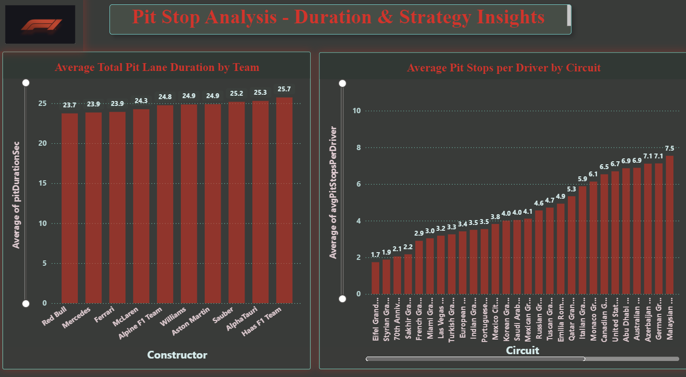
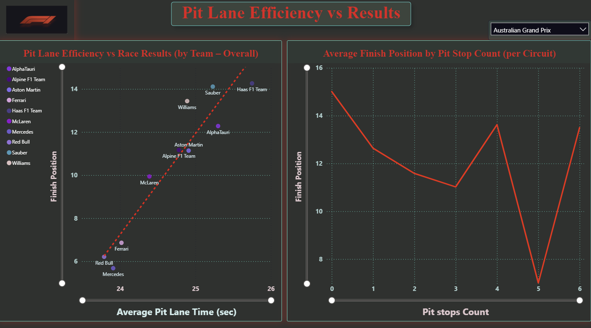
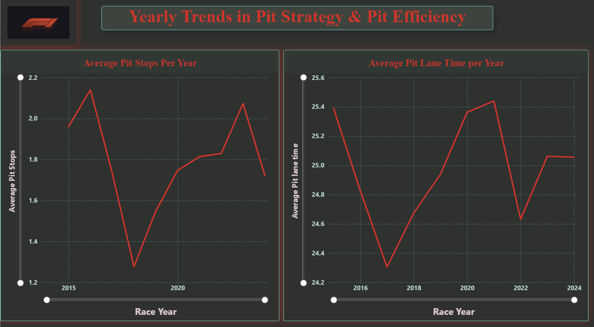

# Power BI Dashboards – Pit Stop Strategy Analysis

This section presents a series of Power BI dashboards analyzing Formula 1 pit stop strategy, pit lane efficiency, and their relationship to race outcomes.  
The dashboards build progressively, starting from descriptive operational metrics and moving toward strategic insights and high-level conclusions.

---

## Dashboards Overview

### 1. Pit Stop Analysis - Duration & Strategy Insights

This dashboard compares the average total pit lane duration across teams.

It highlights clear differences in pit lane execution, with top teams consistently achieving faster average pit lane times, while lower-tier teams operate with longer pit durations.  
The visualization emphasizes operational efficiency as a distinguishing factor between teams, without implying direct causality at this stage.

---

### 2. Pit Strategy vs Race Results

This dashboard examines how average finishing position varies with pit stop count and whether pit stop count alone explains race outcomes.

The analysis shows that pit stop count by itself is not a strong predictor of finishing position.  
Top teams maintain competitive results across different pit stop strategies, while lower-tier teams start from weaker baseline positions regardless of pit stop count.  
This highlights the limitations of using pit stop count as a standalone performance metric.

---

### 3. Pit Lane Efficiency vs Results

This dashboard combines two complementary perspectives:
- A team-level view linking average pit lane time to average finishing position across seasons.
- A circuit-level view showing how finishing position varies by pit stop count for a selected track.

At the team level, faster average pit lane execution is associated with better long-term race results.  
At the circuit level, the relationship between pit stop count and outcome is not linear and varies by track.

Together, the visuals show that pit lane efficiency represents a structural advantage, while optimal pit stop strategy depends heavily on circuit context.

---

### 4. Yearly Trends in Pit Strategy & Pit Efficiency

This dashboard analyzes how pit stop strategy and pit lane efficiency evolve over time.

Both average pit stop count and pit lane time fluctuate across seasons, with no clear long-term linear trend.  
Some seasons favor fewer pit stops, while others involve more frequent stops.

Although certain year-to-year changes in pit lane time appear visually sharp, the actual differences are modest (typically less than one second), reflecting seasonal and regulatory context rather than dramatic operational shifts.

---

### 5. Race Strategy Summary

This dashboard highlights the strongest insights derived from the previous analyses.  
Rather than introducing new charts, it consolidates key findings that emphasize the main relationships between pit stop strategy, pit lane efficiency, and race results.

The summary is designed to provide a high-level overview of the project’s conclusions, focusing on insights rather than detailed chart-level interpretation.
