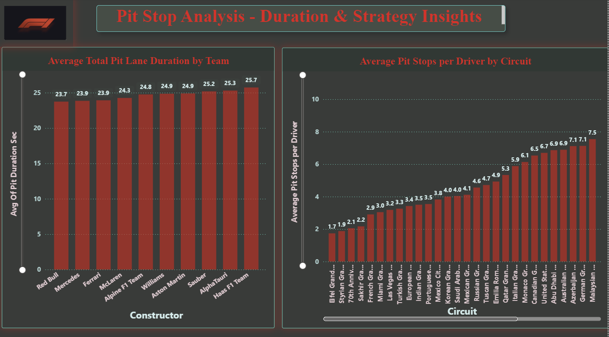
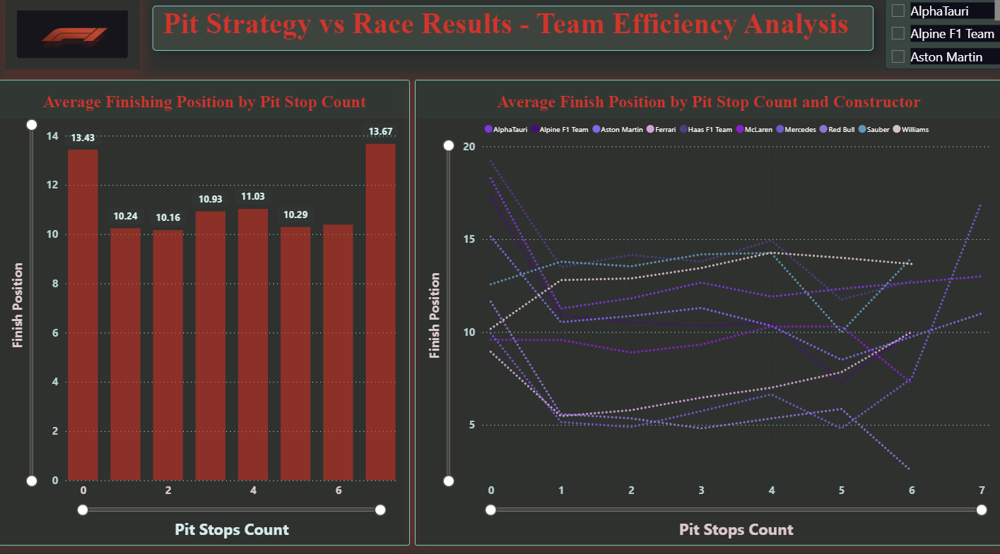
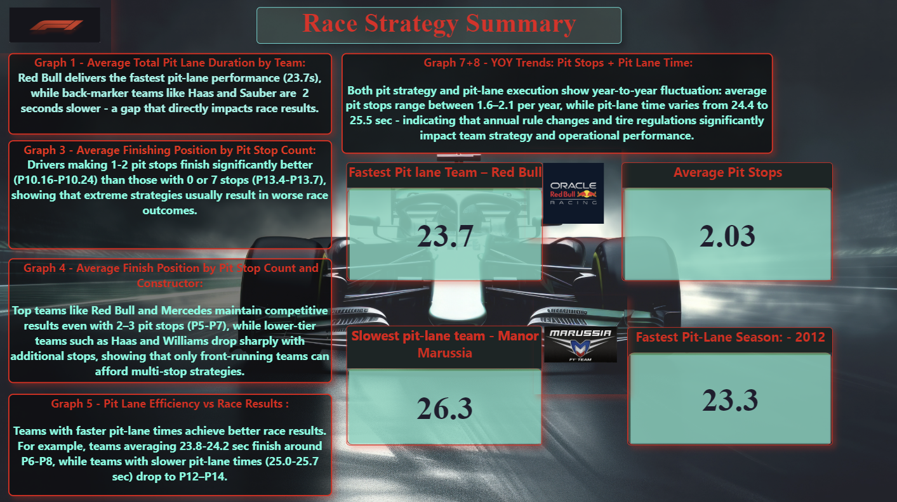

# Power BI Dashboards – Pit Stop Strategy Analysis

This folder contains the Power BI dashboards created as part of the **F1 Pit Stop Strategy Analysis** project.  
Each dashboard explores a different aspect of pit stop behavior, efficiency, and race outcomes, progressing from raw pit performance to strategic insights and final conclusions.

The dashboards are presented below in the same order as they appear in the Power BI report.

---

## 1️⃣ Pit Stop Analysis

This dashboard provides a foundational overview of pit stop performance across teams and circuits.

**Key insights:**
- Clear differences exist in average pit lane duration between teams, highlighting varying operational efficiency.
- Top teams consistently achieve faster and more stable pit times, while lower-tier teams show longer and more variable pit durations.
- Certain circuits are associated with a higher average number of pit stops per driver, reflecting track layout, tire degradation, and strategic complexity.

This dashboard establishes the baseline for understanding pit lane performance before connecting it to race results.

---

## 2️⃣ Pit Strategy vs Results

This dashboard examines how pit stop strategy (number of pit stops) relates to finishing position, both overall and by team.

**Key insights:**
- Drivers completing **1–2 pit stops** generally achieve the best average finishing positions.
- Extreme strategies (very few or many pit stops) are typically associated with worse outcomes.
- When segmented by constructor, leading teams maintain relatively competitive results across multiple strategies, while lower-tier teams tend to perform poorly regardless of the number of stops.

The analysis suggests that while pit stop count matters, team capability and execution quality play a crucial role in determining outcomes.

---

## 3️⃣ Pit Lane Efficiency vs Race Results

This dashboard focuses on the relationship between pit lane efficiency and overall race performance.

**Key insights:**
- Teams with faster average pit lane times tend to achieve better average finishing positions.
- The relationship is consistent across teams, indicating that operational efficiency in the pit lane is a meaningful performance factor.
- A circuit-level view shows that in some races, more aggressive multi-stop strategies can outperform conservative approaches when executed efficiently, emphasizing context-specific strategy decisions.

Overall, this dashboard highlights pit lane efficiency as an important competitive differentiator.

---

## 4️⃣ Yearly Trends in Pit Strategy & Pit Efficiency

This dashboard presents long-term trends in pit stop strategy and pit lane execution over multiple seasons.

**Key insights:**
- The average number of pit stops per year typically ranges between **1.6 and 2.1**, reflecting the dominance of one- and two-stop strategies in modern Formula 1.
- Average pit lane time fluctuates only within a narrow range (approximately **24.4–25.5 seconds**), despite visual variations in the trend line.
- Although the graph may suggest sharp changes year to year, the actual differences in seconds are relatively small, indicating gradual operational improvements rather than dramatic shifts.

These trends reflect the influence of regulation changes, tire compounds, and evolving strategic preferences over time.

---

## 5️⃣ Race Strategy Summary – Overview Page

This final dashboard consolidates the **strongest insights** derived from the previous analyses.

Rather than introducing new visualizations, it highlights selected metrics and conclusions that summarize the project’s main findings:
- The importance of pit lane efficiency for competitive performance.
- The effectiveness of balanced pit stop strategies.
- The consistency of strategic patterns across seasons and teams.

This overview serves as a high-level conclusion, tying together pit stop duration, strategy, efficiency, and race results into a coherent strategic narrative.

---

