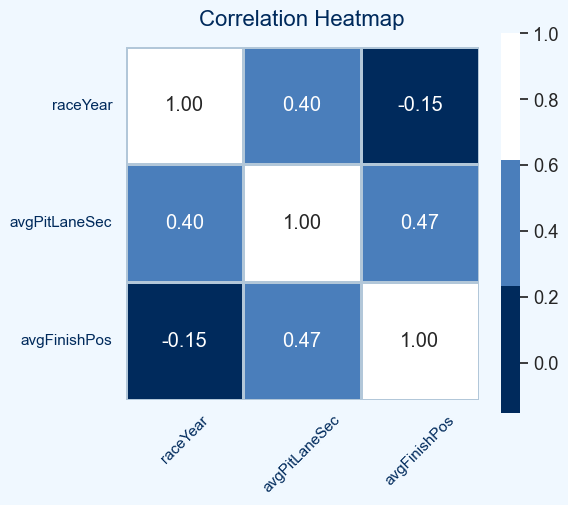

# Correlation Analysis – Key Insights

This analysis explores the relationships between race year, average pit lane time, and average finishing position.

### Key Findings:

**1. AvgPitLaneSec → AvgFinishPos (Moderate positive correlation, r = 0.47)**
* Indicates that pit-lane duration has meaningful explanatory power over race outcome variability.
* Longer stops are associated with poorer finishing positions.

**2. Race Year → AvgPitLaneSec (Weak positive correlation, r = 0.40)**
* Suggests minor temporal drift in pit-stop performance.
* Not substantial enough to denote a structural trend over seasons.

**3. Race Year → AvgFinishPos (Very weak negative correlation, r = -0.15)**
* Reflects negligible year-over-year signal.
* Implies that seasonal progression does not materially influence finishing-position dynamics.
